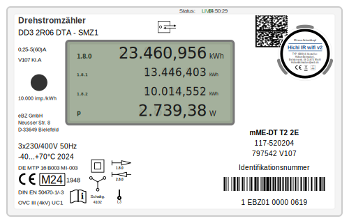

# ⚡ Virtual Three-Phase Current Meter PWA

A photorealistic, web-based Progressive Web App (PWA) that visualizes real-time data from a physical smart meter. This project bridges the gap between raw digital data and a familiar hardware aesthetic.



## 🌟 The Major Benefit
**No coding required for UI customization.** The interface is driven by a standard SVG file. Users can open the GUI file in any vector graphics editor (like **Inkscape**) to match the look of their specific physical meter. The PHP logic remains untouched while the visuals are completely swappable via SVG element IDs.

## ✨ Features
* **Photorealistic UI:** Nearly 1:1 visual representation of a real three-phase meter.
* **PWA Ready:** Installable on iOS, Android, or Desktop for a native app feel.
* **Dynamic Barcodes:** Uses `tc-lib-barcode` to render authentic meter serial numbers.
* **Highly Configurable:** Decoupled configuration logic from the visual presentation.

## 🛠 Tech Stack
* **PHP 8.0+**: Handles data logic and IR-interface integration.
* **SVG**: Provides the high-fidelity, scalable Graphical User Interface.
* **Composer**: Manages essential libraries for barcode generation.

---

## 🚀 Getting Started

### Prerequisites
* **Web Server:** A server with PHP 8.0 or higher installed.
* **Package Manager:** [Composer](https://getcomposer.org/) installed on your machine.
* **Hardware:** An IR-Reading head connected to your smart meter.

### Installation & Setup

1. **Clone the repository:**
```bash
git clone https://github.com/jens62/virtual-3phase-meter.git

```


2. **Install Dependencies:**
This project uses Composer to manage libraries, including `tecnickcom/tc-lib-barcode` for barcode generation and `monolog/monolog` for structured logging. Install them using:
```bash
cd virtual-3phase-meter
composer install

```


3. **Set Permissions:**
The application needs to write to the project directory to save your configuration (`config.php`) and maintain debug logs. On Linux servers, you can grant the web server user (typically `www-data`) the necessary permissions:
```bash
sudo setfacl -R -m u:www-data:rwx /path/to/virtual-3phase-meter

```


4. **Configuration:**
There is no manual configuration file to rename. Simply navigate to `settings.php` in your web browser to initialize the `config.php` file and set up your meter's parameters.
5. **Deployment:**
Upload the project folder to your web server.
**Note:** Ensure the `vendor/` directory (created by Composer) is included in your upload, as it contains all required PHP libraries.

---

## 🎨 How to Customize the GUI
You can change the meter's appearance without touching the PHP code:
1.  Open `svg_template.xml` in **Inkscape**.
2.  Modify colors, textures, or layouts to match your specific hardware.
3.  **Crucial:** Ensure the `id` tags of the text elements (e.g., `id="power_val"`, `id="meter_id"`) remain consistent so the PHP script can inject the data.
4.  Save the file. Your PWA will automatically reflect the new design.

## 📂 Project Structure
* `virtual_meter.php`: The core PWA application and logic.
* `config.php`: Your private configuration (Ignored by Git).
* `svg_template.xml`: The visual interface file.
* `manifest.json`: Web app manifest for PWA installation.
* `assets/fonts/`: Contains the `digital-7 (mono).ttf` font for the display.

